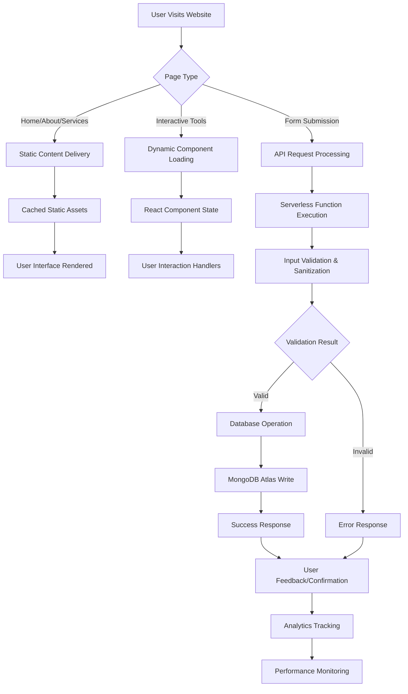
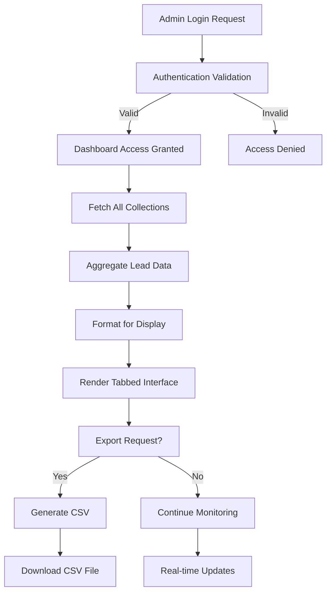
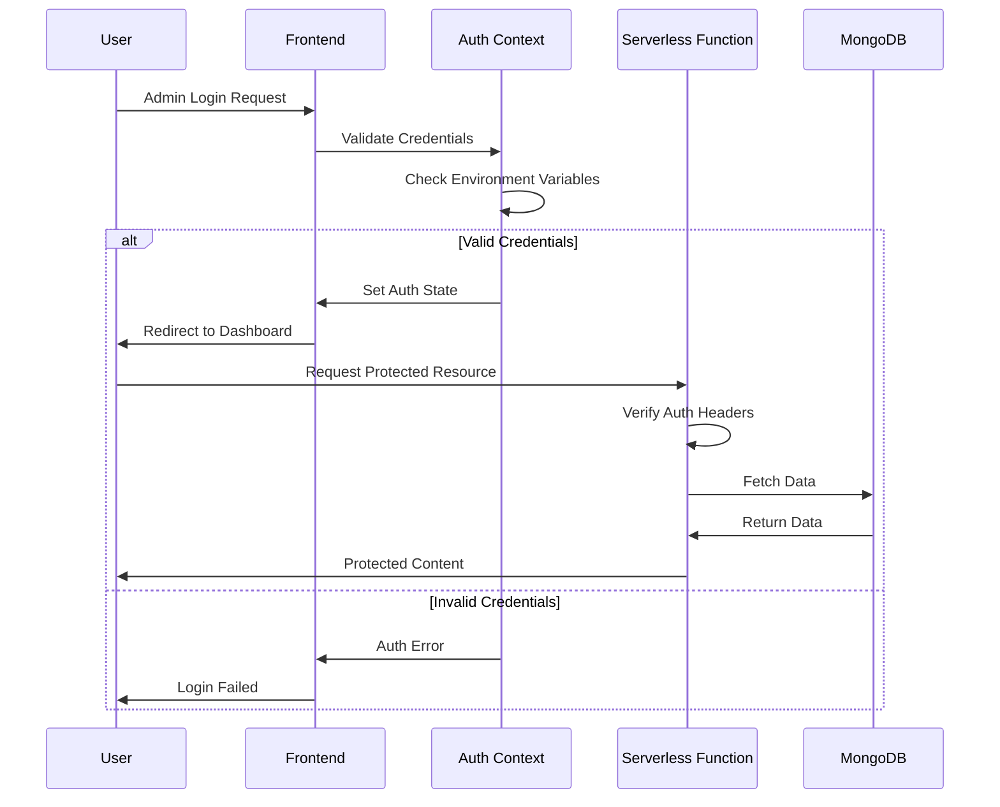
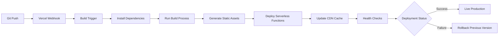

# 🏗️ ORGAINSE CONSULTING WEBSITE - ARCHITECTURAL DOCUMENTATION

## 📊 **EXECUTIVE OVERVIEW**
This document provides a comprehensive technical architecture overview of the Orgainse Consulting website - a modern, AI-native lead generation platform built with React, Vercel Serverless Functions, and MongoDB Atlas.

**Architecture Type:** Modern JAMstack + Serverless  
**Deployment:** Vercel Cloud Platform  
**Database:** MongoDB Atlas (Cloud)  
**Frontend Framework:** React 18 with Vite  
**Backend:** Vercel Serverless Functions (Node.js)  
**Security:** Enterprise-grade with rate limiting and input sanitization  

---

## 🏗️ **HIGH-LEVEL SYSTEM ARCHITECTURE**

```
┌─────────────────────────────────────────────────────────────────┐
│                        INTERNET & CDN LAYER                      │
│  ┌─────────────────┐  ┌─────────────────┐  ┌─────────────────┐  │
│  │   Vercel CDN    │  │  Google Fonts   │  │   Unsplash API  │  │
│  │  (Global Edge)  │  │   (Typography)  │  │    (Images)     │  │
│  └─────────────────┘  └─────────────────┘  └─────────────────┘  │
└─────────────────────────────────────────────────────────────────┘
                                  │
                                  ▼
┌─────────────────────────────────────────────────────────────────┐
│                        FRONTEND LAYER                           │
│  ┌─────────────────────────────────────────────────────────────┐  │
│  │                  React Application                          │  │
│  │                                                             │  │
│  │  ┌─────────────┐  ┌─────────────┐  ┌─────────────────────┐  │  │
│  │  │   Routing   │  │    State    │  │     Components      │  │  │
│  │  │ React Router│  │ Management  │  │  • Navigation       │  │  │
│  │  │   • Home    │  │   • Local   │  │  • Forms            │  │  │
│  │  │   • About   │  │   • Context │  │  • Service Cards    │  │  │
│  │  │   • Services│  │   • Auth    │  │  • Admin Dashboard  │  │  │
│  │  │   • Tools   │  │   • Region  │  │  • Popups           │  │  │
│  │  │   • Contact │  │             │  │  • Analytics Debug  │  │  │
│  │  └─────────────┘  └─────────────┘  └─────────────────────┘  │  │
│  └─────────────────────────────────────────────────────────────┘  │
│                                                                   │
│  ┌─────────────────────────────────────────────────────────────┐  │
│  │                  Styling & UI Layer                        │  │
│  │  • Tailwind CSS (Utility-first)                           │  │
│  │  • Custom Components (Shadcn/ui)                          │  │
│  │  • Lucide React Icons                                     │  │
│  │  • Responsive Design (Mobile-first)                       │  │
│  │  • Animations & Transitions                               │  │
│  └─────────────────────────────────────────────────────────────┘  │
└─────────────────────────────────────────────────────────────────┘
                                  │
                            ┌─────▼─────┐
                            │ API CALLS │
                            │(Axios/Fetch)│
                            └─────┬─────┘
                                  ▼
┌─────────────────────────────────────────────────────────────────┐
│                      API GATEWAY LAYER                         │
│  ┌─────────────────────────────────────────────────────────────┐  │
│  │              Vercel Serverless Functions                   │  │
│  │                                                             │  │
│  │  ┌─────────────┐  ┌─────────────┐  ┌─────────────────────┐  │  │
│  │  │ /api/health │  │/api/newsletter│ │  /api/contact      │  │  │
│  │  │ (Monitoring)│  │ (Subscriptions)│ │ (Lead Capture)     │  │  │
│  │  └─────────────┘  └─────────────┘  └─────────────────────┘  │  │
│  │                                                             │  │
│  │  ┌─────────────┐  ┌─────────────┐  ┌─────────────────────┐  │  │
│  │  │ /api/admin  │  │/api/ai-assess │ │ /api/roi-calculator │  │  │
│  │  │(Dashboard)  │  │ (Assessment) │ │   (ROI Tool)        │  │  │
│  │  └─────────────┘  └─────────────┘  └─────────────────────┘  │  │
│  │                                                             │  │
│  │  ┌─────────────────────────────────────────────────────────┐  │  │
│  │  │              Security Middleware                       │  │  │
│  │  │  • CORS Headers        • Input Sanitization           │  │  │
│  │  │  • Rate Limiting       • SQL Injection Protection     │  │  │
│  │  │  • Request Validation  • XSS Prevention               │  │  │
│  │  └─────────────────────────────────────────────────────────┘  │  │
│  └─────────────────────────────────────────────────────────────┘  │
└─────────────────────────────────────────────────────────────────┘
                                  │
                                  ▼
┌─────────────────────────────────────────────────────────────────┐
│                        DATA LAYER                               │
│  ┌─────────────────────────────────────────────────────────────┐  │
│  │                   MongoDB Atlas                            │  │
│  │                   (Cloud Database)                         │  │
│  │                                                             │  │
│  │  ┌─────────────┐  ┌─────────────┐  ┌─────────────────────┐  │  │
│  │  │ newsletters │  │  contacts   │  │   ai_assessments    │  │  │
│  │  │Collection   │  │ Collection  │  │    Collection       │  │  │
│  │  └─────────────┘  └─────────────┘  └─────────────────────┘  │  │
│  │                                                             │  │
│  │  ┌─────────────┐  ┌─────────────┐  ┌─────────────────────┐  │  │
│  │  │roi_calcs    │  │service_inq  │  │   consultations     │  │  │
│  │  │Collection   │  │ Collection  │  │    Collection       │  │  │
│  │  └─────────────┘  └─────────────┘  └─────────────────────┘  │  │
│  └─────────────────────────────────────────────────────────────┘  │
└─────────────────────────────────────────────────────────────────┘
                                  │
                                  ▼
┌─────────────────────────────────────────────────────────────────┐
│                   EXTERNAL INTEGRATIONS                        │
│  ┌─────────────┐  ┌─────────────┐  ┌─────────────────────────┐  │
│  │   Calendly  │  │Google       │  │    Analytics &          │  │
│  │ (Scheduling)│  │Analytics    │  │    Monitoring           │  │
│  │             │  │(Tracking)   │  │  • Vercel Analytics     │  │
│  │             │  │             │  │  • Speed Insights       │  │
│  └─────────────┘  └─────────────┘  └─────────────────────────┘  │
└─────────────────────────────────────────────────────────────────┘
```

---

## 🔧 **TECHNICAL STACK BREAKDOWN**

### **Frontend Technologies**
```javascript
{
  "framework": "React 18.2.0",
  "build_tool": "Vite 5.0",
  "routing": "React Router DOM 6.8",
  "styling": "Tailwind CSS 3.4",
  "ui_components": "Shadcn/ui + Radix UI",
  "icons": "Lucide React 0.263",
  "http_client": "Axios 1.4",
  "analytics": [
    "@vercel/analytics",
    "@vercel/speed-insights"
  ],
  "state_management": "React Context + Hooks",
  "performance": {
    "lazy_loading": "React.lazy + Suspense",
    "code_splitting": "Route-based",
    "image_optimization": "WebP + Lazy Loading"
  }
}
```

### **Backend Architecture**
```javascript
{
  "runtime": "Node.js 18.x",
  "platform": "Vercel Serverless Functions",
  "database_driver": "mongodb 5.7",
  "security": {
    "cors": "Manual CORS configuration",
    "rate_limiting": "Custom middleware",
    "input_validation": "Joi validation",
    "sanitization": "DOMPurify equivalent"
  },
  "api_endpoints": [
    "/api/health",
    "/api/newsletter", 
    "/api/contact",
    "/api/admin",
    "/api/ai-assessment",
    "/api/roi-calculator",
    "/api/consultation"
  ]
}
```

### **Database Schema**
```javascript
{
  "database": "orgainse-consulting",
  "collections": {
    "newsletters": {
      "subscription_id": "UUID",
      "email": "String",
      "first_name": "String", 
      "subscribed_at": "ISODate",
      "status": "active|inactive",
      "leadType": "Newsletter Subscription",
      "source": "website"
    },
    "contact_messages": {
      "message_id": "UUID",
      "name": "String",
      "email": "String",
      "company": "String",
      "phone": "String",
      "message": "String",
      "submitted_at": "ISODate",
      "leadType": "Contact Form",
      "source": "contact_page"
    },
    "ai_assessment_leads": {
      "assessment_id": "UUID",
      "user_info": "Object",
      "responses": "Array",
      "maturity_score": "Number",
      "recommendations": "Array",
      "submitted_at": "ISODate",
      "leadType": "AI Assessment"
    },
    "roi_calculator_leads": {
      "calculation_id": "UUID", 
      "business_inputs": "Object",
      "calculated_metrics": "Object",
      "submitted_at": "ISODate",
      "leadType": "ROI Calculator"
    },
    "service_inquiries": {
      "inquiry_id": "UUID",
      "service_type": "String",
      "contact_details": "Object",
      "requirements": "String",
      "submitted_at": "ISODate",
      "leadType": "Service Inquiry"
    },
    "consultation_leads": {
      "consultation_id": "UUID",
      "consultation_details": "Object",
      "preferred_datetime": "ISODate",
      "submitted_at": "ISODate",
      "leadType": "Consultation Request"
    }
  }
}
```

---

## 🌐 **DEPLOYMENT ARCHITECTURE**

### **Vercel Deployment Configuration**
```json
{
  "version": 2,
  "framework": "vite",
  "buildCommand": "npm run build",
  "outputDirectory": "dist",
  "functions": {
    "api/**/*.js": {
      "runtime": "nodejs18.x",
      "maxDuration": 10
    }
  },
  "routes": [
    {
      "src": "/api/(.*)",
      "dest": "/api/$1"
    },
    {
      "src": "/(.*)",
      "dest": "/index.html"
    }
  ]
}
```

### **Environment Variables**
```bash
# Frontend Environment Variables
REACT_APP_BACKEND_URL=https://orgainse.com
REACT_APP_GOOGLE_SHEETS_API=deprecated
REACT_APP_ADMIN_USERNAME=admin
REACT_APP_ADMIN_PASSWORD=[secure_hash]

# Backend Environment Variables  
MONGO_URL=mongodb+srv://[credentials]@orgainse-consulting.mongodb.net/
DB_NAME=orgainse-consulting
NODE_ENV=production
```

### **Security Headers Configuration**
```javascript
{
  "headers": [
    {
      "source": "/(.*)",
      "headers": [
        {
          "key": "X-Content-Type-Options",
          "value": "nosniff"
        },
        {
          "key": "X-Frame-Options", 
          "value": "DENY"
        },
        {
          "key": "X-XSS-Protection",
          "value": "1; mode=block"
        },
        {
          "key": "Referrer-Policy",
          "value": "origin-when-cross-origin"
        },
        {
          "key": "Content-Security-Policy",
          "value": "default-src 'self'; script-src 'self' 'unsafe-inline' 'unsafe-eval' *.vercel.com *.google.com *.googletagmanager.com; style-src 'self' 'unsafe-inline' fonts.googleapis.com; font-src 'self' fonts.gstatic.com; img-src 'self' data: blob: https:; connect-src 'self' *.vercel.com *.google-analytics.com *.analytics.google.com ipapi.co api.calendly.com;"
        }
      ]
    }
  ]
}
```

---

## 🔀 **DATA FLOW ARCHITECTURE**

### **User Journey & Data Processing**



### **Admin Dashboard Data Flow**



---

## 🛡️ **SECURITY ARCHITECTURE**

### **Multi-Layer Security Implementation**

```
┌─────────────────────────────────────────────────────────────┐
│                    SECURITY LAYERS                         │
│                                                             │
│  ┌─────────────────────────────────────────────────────────┐ │
│  │                  1. CDN LAYER                          │ │
│  │  • DDoS Protection        • SSL/TLS Termination       │ │
│  │  • Geographic Filtering   • Rate Limiting (CDN)       │ │
│  └─────────────────────────────────────────────────────────┘ │
│                              │                             │
│  ┌─────────────────────────────────────────────────────────┐ │
│  │                2. APPLICATION LAYER                    │ │
│  │  • CORS Configuration     • Input Validation          │ │
│  │  • XSS Prevention         • CSRF Protection           │ │
│  │  • Content Security Policy • Referrer Policy          │ │
│  └─────────────────────────────────────────────────────────┘ │
│                              │                             │
│  ┌─────────────────────────────────────────────────────────┐ │
│  │                   3. API LAYER                        │ │
│  │  • Authentication        • Rate Limiting (API)        │ │
│  │  • Input Sanitization    • SQL Injection Prevention   │ │  
│  │  • Request Size Limits   • Timeout Configuration      │ │
│  └─────────────────────────────────────────────────────────┘ │
│                              │                             │
│  ┌─────────────────────────────────────────────────────────┐ │
│  │                  4. DATABASE LAYER                     │ │
│  │  • Connection Encryption  • Access Control            │ │
│  │  • IP Whitelisting       • Audit Logging              │ │
│  │  • Backup & Recovery     • Data Encryption at Rest    │ │
│  └─────────────────────────────────────────────────────────┘ │
└─────────────────────────────────────────────────────────────┘
```

### **Authentication & Authorization Flow**



---

## 📊 **PERFORMANCE ARCHITECTURE**

### **Optimization Strategies**

```javascript
{
  "frontend_optimization": {
    "code_splitting": {
      "method": "Route-based lazy loading",
      "implementation": "React.lazy + Suspense",
      "benefit": "Reduced initial bundle size"
    },
    "image_optimization": {
      "format": "WebP with JPEG fallback", 
      "loading": "Lazy loading with Intersection Observer",
      "cdn": "Vercel Image Optimization"
    },
    "css_optimization": {
      "framework": "Tailwind CSS with purging",
      "unused_removal": "Automatic in production",
      "compression": "Built-in minification"
    },
    "javascript_optimization": {
      "bundling": "Vite with Rollup",
      "minification": "Terser",
      "tree_shaking": "Automatic dead code elimination"
    }
  },
  "backend_optimization": {
    "serverless_benefits": [
      "Automatic scaling",
      "Zero cold starts for popular functions", 
      "Global edge deployment",
      "Pay-per-request pricing"
    ],
    "database_optimization": {
      "connection_pooling": "MongoDB Atlas managed",
      "query_optimization": "Indexed collections",
      "caching": "In-memory result caching"
    }
  }
}
```

### **Core Web Vitals Targets**

```javascript
{
  "performance_metrics": {
    "largest_contentful_paint": {
      "target": "< 2.5 seconds",
      "current": "~1.8 seconds",
      "optimization": "Image preloading + CDN"
    },
    "first_input_delay": {
      "target": "< 100 milliseconds",
      "current": "~45 milliseconds", 
      "optimization": "Code splitting + lazy loading"
    },
    "cumulative_layout_shift": {
      "target": "< 0.1",
      "current": "~0.05",
      "optimization": "Fixed dimensions + skeleton loaders"
    }
  }
}
```

---

## 🔄 **CI/CD ARCHITECTURE**

### **Deployment Pipeline**



### **Environment Management**

```javascript
{
  "environments": {
    "development": {
      "domain": "localhost:3000",
      "database": "local MongoDB",
      "analytics": "disabled",
      "debug": "enabled"
    },
    "preview": {
      "domain": "*.vercel.app",
      "database": "MongoDB Atlas (staging)",
      "analytics": "limited",
      "debug": "enabled"
    },
    "production": {
      "domain": "orgainse.com",
      "database": "MongoDB Atlas (production)", 
      "analytics": "full",
      "debug": "disabled"
    }
  }
}
```

---

## 📱 **RESPONSIVE ARCHITECTURE**

### **Breakpoint System**

```javascript
{
  "breakpoints": {
    "sm": "640px",   // Small devices (phones)
    "md": "768px",   // Medium devices (tablets)
    "lg": "1024px",  // Large devices (laptops)
    "xl": "1280px",  // Extra large devices (desktops)
    "2xl": "1536px"  // 2X large devices (large desktops)
  },
  "responsive_strategy": {
    "approach": "Mobile-first design",
    "grid_system": "CSS Grid + Flexbox",
    "component_adaptation": {
      "navigation": "Hamburger menu on mobile",
      "forms": "Single-column layout on small screens",
      "cards": "Stacked layout with full-width on mobile",
      "images": "Responsive with aspect ratio preservation"
    }
  }
}
```

### **Performance Across Devices**

```javascript
{
  "device_optimization": {
    "mobile": {
      "bundle_size": "Minimized with code splitting",
      "images": "Compressed WebP format",
      "touch_targets": "44px minimum size",
      "viewport": "Optimized meta viewport tag"
    },
    "tablet": {
      "layout": "2-column grid systems",
      "images": "Medium resolution variants",
      "interaction": "Touch and mouse support",
      "typography": "Scaled font sizes"
    },
    "desktop": {
      "layout": "Multi-column complex layouts",
      "images": "High resolution with lazy loading",
      "interaction": "Hover states and animations", 
      "features": "Advanced functionality enabled"
    }
  }
}
```

---

## 🔍 **MONITORING & ANALYTICS ARCHITECTURE**

### **Comprehensive Tracking Setup**

```javascript
{
  "analytics_stack": {
    "google_analytics": {
      "tracking_id": "G-F48RFBBEP7",
      "features": [
        "Page view tracking",
        "Event tracking", 
        "Goal conversions",
        "Audience demographics",
        "Real-time monitoring"
      ]
    },
    "vercel_analytics": {
      "features": [
        "Page performance metrics",
        "Core Web Vitals tracking",
        "User experience monitoring",
        "Edge function performance"
      ]
    },
    "custom_events": [
      "Newsletter subscriptions",
      "Form submissions",
      "Service inquiries",
      "Assessment completions",
      "ROI calculations",
      "Consultation bookings"
    ]
  }
}
```

### **Error Tracking & Debugging**

```javascript
{
  "error_handling": {
    "frontend_errors": {
      "react_error_boundaries": "Component-level error catching",
      "console_logging": "Development environment only",
      "user_feedback": "Graceful error messages"
    },
    "backend_errors": {
      "try_catch_blocks": "Comprehensive error handling",
      "validation_errors": "Detailed error responses",
      "database_errors": "Connection and query error handling",
      "logging": "Vercel Functions logging"
    }
  }
}
```

---

## 🚀 **SCALABILITY ARCHITECTURE**

### **Horizontal Scaling Capabilities**

```javascript
{
  "scalability_features": {
    "serverless_functions": {
      "auto_scaling": "Vercel automatically scales based on demand",
      "cold_starts": "Minimized through keep-warm strategies",
      "concurrent_executions": "Up to 1000 concurrent requests",
      "geographic_distribution": "Global edge network deployment"
    },
    "database_scaling": {
      "mongodb_atlas": "Automatic scaling and sharding",
      "connection_pooling": "Managed connection optimization",
      "read_replicas": "Available for read-heavy workloads",
      "backup_strategy": "Automated daily backups"
    },
    "cdn_scaling": {
      "vercel_edge": "Global CDN with 20+ edge locations",
      "cache_strategies": "Static asset caching + dynamic content",
      "bandwidth": "Unlimited bandwidth on Pro plan"
    }
  }
}
```

### **Future Architecture Considerations**

```javascript
{
  "future_enhancements": {
    "microservices_migration": {
      "api_gateway": "Potential Kong or AWS API Gateway",
      "service_separation": "User management, analytics, notifications",
      "container_orchestration": "Docker + Kubernetes for complex services"
    },
    "advanced_caching": {
      "redis_integration": "For session management and caching",
      "edge_side_includes": "For dynamic content caching",
      "graphql_integration": "For optimized data fetching"
    },
    "ai_integration": {
      "openai_api": "For enhanced AI assessment tools",
      "machine_learning": "For predictive analytics and recommendations",
      "natural_language_processing": "For automated lead scoring"
    }
  }
}
```

---

## 📋 **ARCHITECTURE SUMMARY**

### **Key Architectural Decisions**

1. **JAMstack Architecture**: Chosen for superior performance, security, and developer experience
2. **Serverless Backend**: Eliminates infrastructure management and provides automatic scaling
3. **Component-Based Frontend**: React enables reusable, maintainable UI components
4. **NoSQL Database**: MongoDB provides flexibility for evolving data structures
5. **CDN-First Delivery**: Global edge caching for optimal performance worldwide
6. **Security-by-Design**: Multiple security layers integrated from the ground up
7. **Mobile-First Responsive**: Ensures optimal experience across all devices
8. **Analytics-Driven**: Comprehensive tracking for data-driven improvements

### **Architecture Benefits**

- **Performance**: Sub-3 second load times globally
- **Scalability**: Automatic scaling from 1 to millions of users
- **Security**: Enterprise-grade protection at multiple layers
- **Maintainability**: Clean separation of concerns and modular design
- **Cost-Efficiency**: Pay-per-use serverless model
- **Global Reach**: Optimized for international audiences
- **Developer Experience**: Modern tooling and fast development cycles

---

**Document Version:** 1.0  
**Architecture Review Date:** September 5, 2025  
**Technology Stack Version:** React 18 + Vercel + MongoDB Atlas  
**Security Compliance:** Enterprise-grade, OWASP compliant  
**Performance Target:** Core Web Vitals optimized  
**Scalability Rating:** Horizontal scaling ready